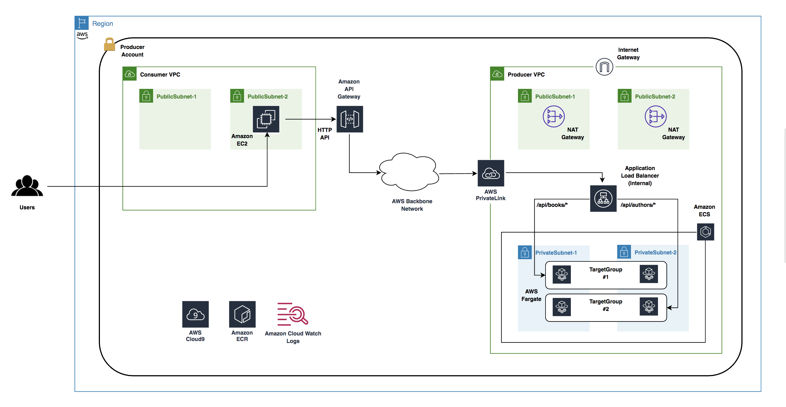

# Build HTTP API Based Services using Amazon API Gateway, AWS PrivateLink, AWS Fargate and AWS CDK

## Architecture

## Configure AWS Cloud9

####   Create AWS Cloud9 environment
  - It is recommended too create an AWS Cloud9 environment to run these code samples. Follow the instructions [here](https://docs.aws.amazon.com/cloud9/latest/user-guide/create-environment-main.html).

####   Resize AWS Cloud9 environment

  - You can also resize the Amazon Elastic Block Store (Amazon EBS) volume that is associated with an Amazon EC2 instance for an environment. The detailed steps are documented [here](https://docs.aws.amazon.com/cloud9/latest/user-guide/move-environment.html#move-environment-resize).

####   Upload the code sample folder to Cloud9

  - Use File/Upload Local Files ... from the Cloud9 menu to upload the code sample files ino the AWS Cloud9 environment.

## Deploy the code samples
  - The following commands should be run from the root of the code sample directory.

####   Install AWS CDK packages

  - `npm install`

####   Compile typescript files

  - `npm run build`

####   Synthesize CDK

  - `cdk synth`

####   Deploy the CDK stack

  - `cdk deploy`
