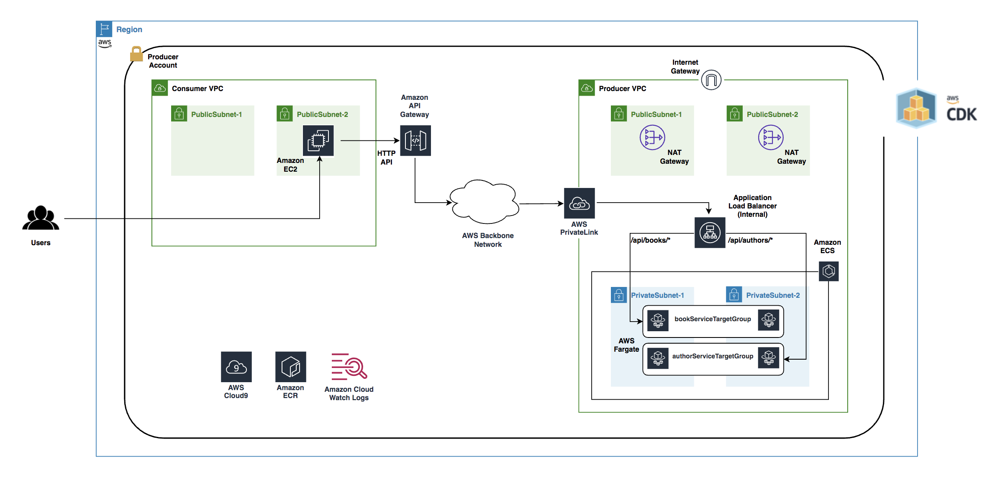
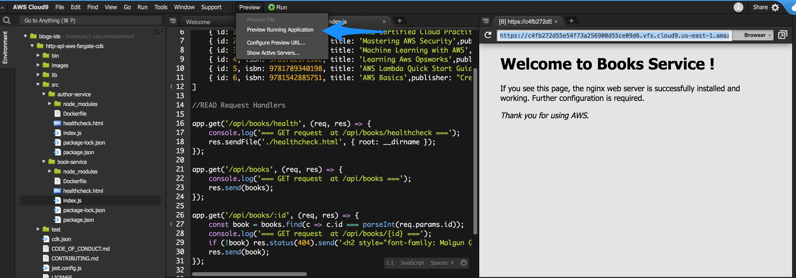
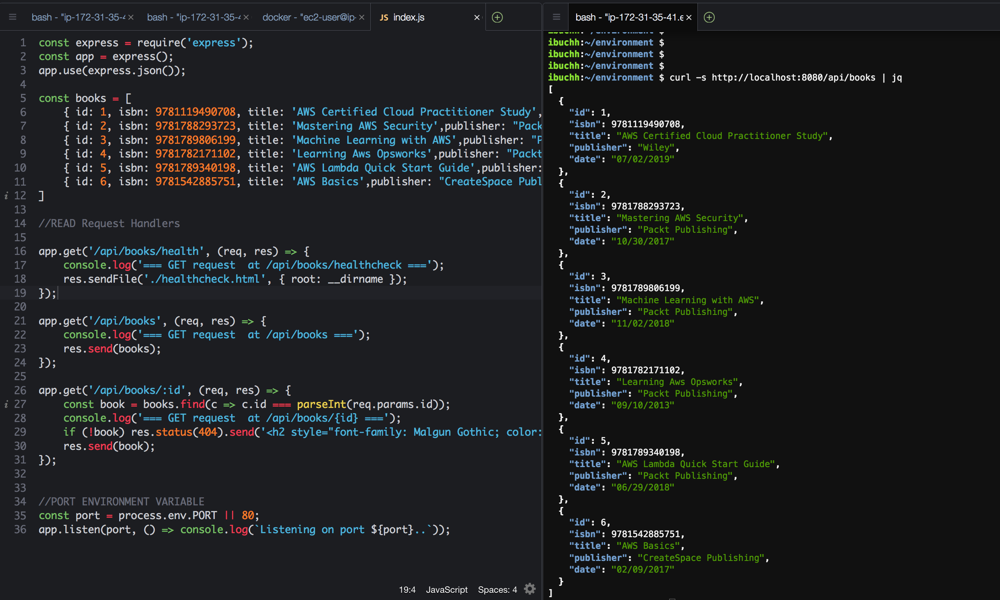
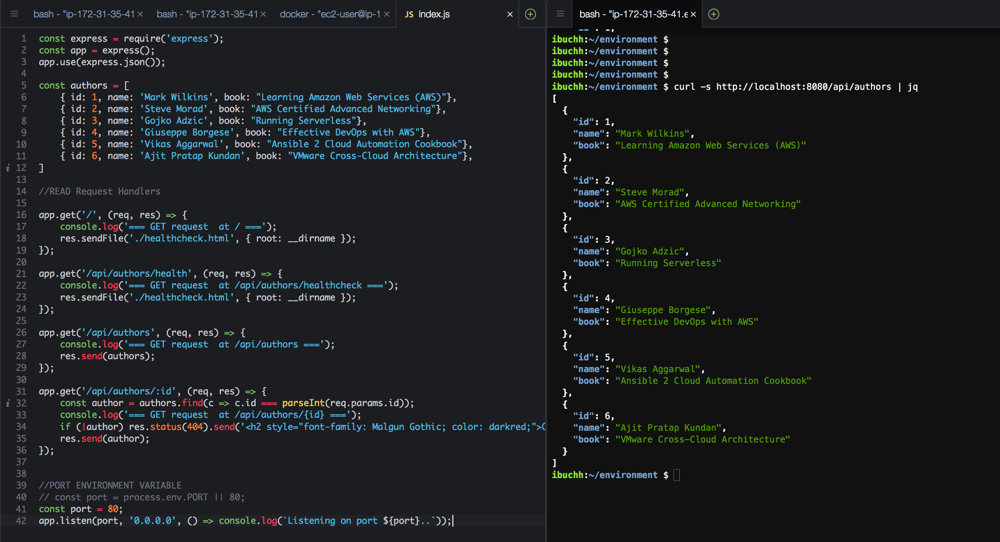
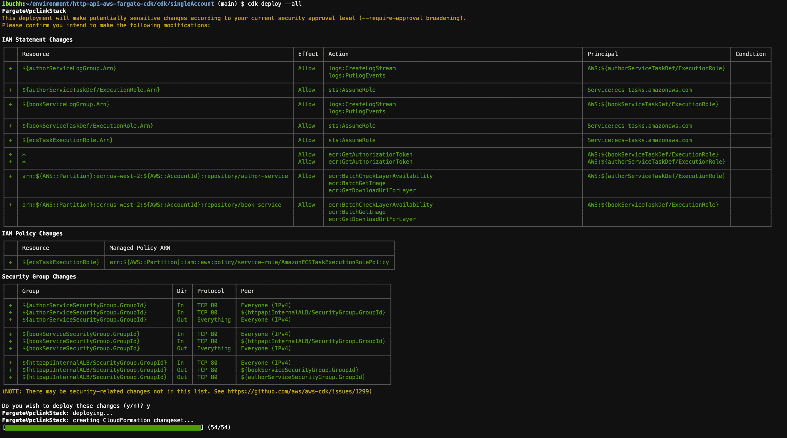
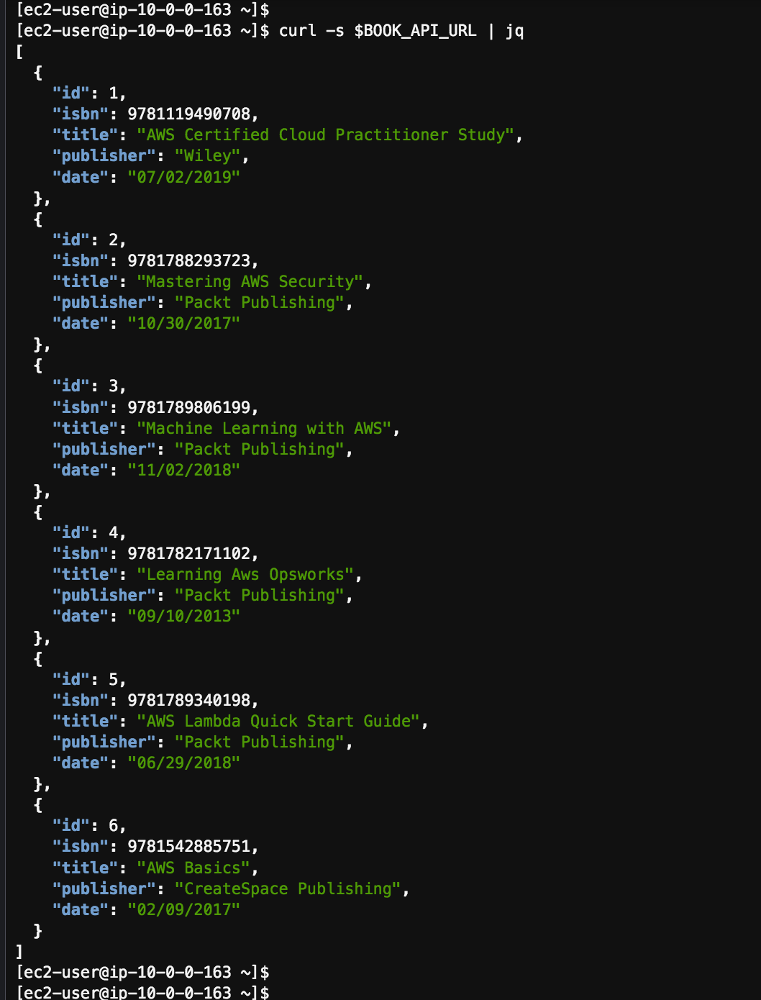
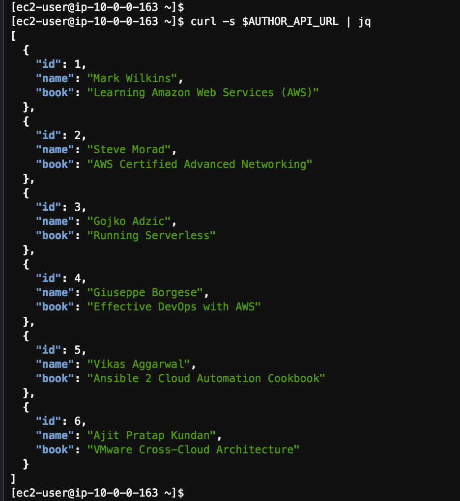

# Building HTTP API-based services using Amazon API Gateway, AWS PrivateLink, AWS Fargate and AWS CDK

[](https://gitpod.io/#https://github.com/aws/aws-cdk)
[](https://badge.fury.io/js/aws-cdk)
[](https://badge.fury.io/py/aws-cdk.core)
[](https://badge.fury.io/nu/Amazon.CDK)

## Introduction
Prior to the availability of AWS PrivateLink, services residing in a single Amazon VPC were connected to multiple Amazon VPCs either (1) through public IP addresses using each VPC’s internet gateway or (2) by private IP addresses using VPC peering.

With AWS PrivateLink, service connectivity over Transmission Control Protocol (TCP) can be established from the service provider’s VPC (Producer) to the service consumer’s VPC (Consumer) in a secure and scalable manner. Tom Adamski has provided an [architecture](https://aws.amazon.com/blogs/networking-and-content-delivery/how-to-securely-publish-internet-applications-at-scale-using-application-load-balancer-and-aws-privatelink/) where he shows one way of using AWS PrivateLink along with ALB and NLBs to publish Internet applications at scale. Mani Chandrasekaran provided a [solution](https://aws.amazon.com/blogs/compute/access-private-applications-on-aws-fargate-using-amazon-api-gateway-privatelink/) where he uses API Gateway to expose applications running on AWS Fargate using REST APIs, but it uses NLB since ALB is not yet supported by this architecture.

Our solution leverages the existing applications/ APIs running in AWS Fargate behind a Private ALB inside a VPC and proposes an architecture to expose these APIs securely through HTTP APIs using Amazon API Gateway and AWS PrivateLink.

The target audience for this workshop are developers and architects who want to architect API based services using the existing applications running inside Amazon VPCs.

## Prerequisites
In order to implement the instructions laid out in this post, you will need the following:
- An [AWS account](https://aws.amazon.com/premiumsupport/knowledge-center/create-and-activate-aws-account/)

## Architecture
As shown in Fig 1, we shall create one AWS CDK application consisting of two AWS CDK stacks **FargateVpclinkStack** and **HttpApiStack**. Inside the FargateVpclinkStack, we deploy two NodeJS microservices (book-service and author-service) using Amazon Fargate within the Producer VPC. An internal load balancer distributes external incoming application traffic across these two microservices. In order to implement the private integration we create a VpcLink to encapsulate connections between API Gateway and these microservices. Inside the HttpApiStack, we create an Http Api that integrates with the Amazon Fargate microservices running inside the FargateVpclinkStack using the Vpclink and internal load balancer listener.


*Fig 1 - Architecture*

Here are the steps we’ll be following to implement the above architecture:

- Create and configure AWS Cloud9 environment
- Build two sample microservices
- Examine the CDK code for FargateVpclinkStack and HttpApiStack
- Provision AWS resources using the CDK
- Test the Http Api
- Cleanup


## Create and configure AWS Cloud9 environment
Log into the AWS Management Console and search for Cloud9 service in the search bar.

Click Cloud9 and create an AWS Cloud9 environment in the us-west-2 region based on Amazon Linux 2. Create an IAM role for Cloud9 workspace as explained [here](https://www.eksworkshop.com/020_prerequisites/iamrole/). Attache the IAM role to your workspace as explained [here](https://www.eksworkshop.com/020_prerequisites/ec2instance/). Turn off the AWS managed temporary credentials of the Cloud9 environment as explained [here](https://www.eksworkshop.com/020_prerequisites/workspaceiam/). Open a new terminal in Cloud9 and install jq using the command:

```bash
sudo yum install jq -y
```

## Build two sample microservices

### Clone the GitHub repository

Open a new terminal inside AWS Cloud9 IDE and run:

git clone https://github.com/aws-samples/http-api-aws-fargate-cdk.git

### Build and test book-service locally

Replace XXXXXXXXXXX with your AWS account id. 

```bash
cd ~/environment/http-api-aws-fargate-cdk/src/book-service
npm install --save 
docker build -t book-service  .
docker tag book-service:latest \ 
    XXXXXXXXXXX.dkr.ecr.us-west-2.amazonaws.com/book-service:latest

docker run -p8080:80 book-service
```
Click the `Preview/Preview Running Application` and append api/books/health to the end of the url so that url looks like `https://XXXXXXXXXXXXXXXXXXX.vfs.cloud9.us-west-2.amazonaws.com/api/books/health` . Observe the response from the running book-service service as shown in Fig 2.


*Fig 2 - Books Service*

Open a new terminal inside AWS Cloud9 IDE and run the following curl command:

```bash
curl -s http://localhost:8080/api/books | jq
```
Observe the response as shown in the right hand pane of Fig 3.


*Fig 3 - Books Service*

In order to avoid the port conflict later on, kill the book-service container by running: 

```bash
docker ps
```
Get the 'CONTAINER ID' from the previous command and then run:

```bash
docker kill <CONTAINER ID>
```

### Build and test author-service locally

Replace XXXXXXXXXXX with your AWS account id.

```bash
cd ~/environment/http-api-aws-fargate-cdk/src/author-service
npm install --save 
docker build -t author-service  .
docker tag author-service:latest \ 
    XXXXXXXXXXX.dkr.ecr.us-west-2.amazonaws.com/author-service:latest

docker run -p8080:80 author-service
```
Click the `Preview/Preview Running Application` and append api/authors/health to the end of the url so that url looks like `https://XXXXXXXXXXXXXXXXXXX.vfs.cloud9.us-west-2.amazonaws.com/api/authors/health` . Observe the response from the running book-service service as shown in the right hand pane of Fig 4.


*Fig 4 - Authors Service*

### Create Amazon ECR repositories

Amazon ECR registries host your container images in a highly available and scalable architecture, allowing you to deploy containers reliably for your applications. Each AWS account is provided with a single (default) Amazon ECR registry. 

Replace XXXXXXXXXXX with your AWS account id and using terminal inside AWS Cloud9 IDE run:

```bash
aws ecr get-login-password --region us-west-2 | docker login  --username AWS   --password-stdin XXXXXXXXXXX.dkr.ecr.us-west-2.amazonaws.com

aws ecr create-repository \
    --repository-name book-service \
    --image-scanning-configuration scanOnPush=false \
    --region us-west-2

aws ecr create-repository \
    --repository-name author-service \
    --image-scanning-configuration scanOnPush=false \
    --region us-west-2
```

### Push images to Amazon ECR

Replace XXXXXXXXXXX with your AWS account id and using terminal inside AWS Cloud9 IDE run:

```bash
docker push XXXXXXXXXXX.dkr.ecr.us-west-2.amazonaws.com/book-service:latest

docker push XXXXXXXXXXX.dkr.ecr.us-west-2.amazonaws.com/author-service:latest
```
## Examine the CDK code for FargateVpclinkStack and HttpApiStack

### Creating AWS resources using the CDK

We shall implement this architecture using an AWS CDK application comprising of two individual CDK stacks:

- **FargateVpclinkStack** -- contains the Fargate and Vpclink resources.
- **HttpApiStack** -- contains the Http Api integrated with Fargate services using Vpclink.

Let us discuss these stacks one by one.

### **FargateVpclinkStack**
<p align="center">
<image src="./images/FargateVpclinkStack.png"  height=500px>
</p>

Under the cdk/singleAccount/lib folder, open the fargate-vpclink-stack.ts file and let us explore the following different CDK constructs.

Export Vpclink and ALB Listener:
```typescript
 public readonly httpVpcLink: cdk.CfnResource;
 public readonly httpApiListener: elbv2.ApplicationListener;
 ```

These two variables enable us to export the provisioned Vpclink along with the ALB Listener from **FargateVpclinkStack** stack so as to use these to create the Http Api in the **HttpApiStack** stack.

**VPC:**

This single line of code creates a ProducerVPC with two Public and two Private Subnets.
```typescript
    const vpc = new ec2.Vpc(this, "ProducerVPC");
```

**ECS Cluster:**

This creates an Amazon ECS cluster inside the ProducerVPC, we shall be running the two microservices inside this ECS cluster using AWS Fargate.

```typescript
    const cluster = new ecs.Cluster(this, "Fargate Cluster" , {
      vpc : vpc,
});
```

**Cloud Map Namespace:**

AWS Cloud Map allows us to register any application resources, such as microservices, and other cloud resources, with custom names.Using AWS Cloud Map, we can define custom names for our application microservices, and it maintains the updated location of these dynamically changing microservices.

```typescript
    const dnsNamespace = new servicediscovery.PrivateDnsNamespace(this,"DnsNamespace",{
        name: "http-api.local",
        vpc: vpc,
        description: "Private DnsNamespace for Microservices",
      }
    );
```
**ECS Task Role:**
```typescript
    const taskrole = new iam.Role(this, 'ecsTaskExecutionRole', {
      assumedBy: new iam.ServicePrincipal('ecs-tasks.amazonaws.com')
    });

    taskrole.addManagedPolicy(iam.ManagedPolicy.fromAwsManagedPolicyName('service-role/AmazonECSTaskExecutionRolePolicy'));
```
    
**Task Definitions:**

A task definition is required to run Docker containers in Amazon ECS, we shall create the task definitions (bookServiceTaskDefinition and authorServiceTaskDefinition) for the two microservices.
```typescript
    const bookServiceTaskDefinition = new ecs.FargateTaskDefinition(this,
'bookServiceTaskDef', {
      memoryLimitMiB: 512,
      cpu: 256,
      taskRole: taskrole
    });

      const authorServiceTaskDefinition = new ecs.FargateTaskDefinition(this, 
'authorServiceTaskDef', {
      memoryLimitMiB: 512,
      cpu: 256,
      taskRole: taskrole
    });
```
**Log Groups:**

Let us create two log groups bookServiceLogGroup and authorServiceLogGroup and the two associated log drivers.

```typescript
    const bookServiceLogGroup = new logs.LogGroup(this, "bookServiceLogGroup", {
      logGroupName: "/ecs/BookService",
      removalPolicy: cdk.RemovalPolicy.DESTROY
    });
    
    const authorServiceLogGroup = new logs.LogGroup(this, "authorServiceLogGroup", {
      logGroupName: "/ecs/AuthorService",
      removalPolicy: cdk.RemovalPolicy.DESTROY
    });
    
    const bookServiceLogDriver = new ecs.AwsLogDriver({
        logGroup: bookServiceLogGroup,
        streamPrefix: "BookService"
      });
      
    const authorServiceLogDriver = new ecs.AwsLogDriver({
        logGroup: authorServiceLogGroup,
        streamPrefix: "AuthorService"
      });
```
**ECR Repositories:**

Amazon Elastic Container Registry (ECR) is a fully managed container registry that makes it easy to store, manage, share, and deploy container images containing the business logic of the microservices. Let us import the two repositories book-service and author-service that we created earlier using AWS CLI.
```typescript
    // Amazon ECR Repositories
    const bookservicerepo = ecr.Repository.fromRepositoryName(this, 
      "bookservice",
      "book-service",
    );

    const authorservicerepo = ecr.Repository.fromRepositoryName(this, 
      "authorservice",
      "author-service",
    );
```  
**Task Containers:**

We shall define a single container in each task definition.

```typescript
    const bookServiceContainer = 
        bookServiceTaskDefinition.addContainer("bookServiceContainer", {
          image: ecs.ContainerImage.fromEcrRepository(bookservicerepo),
          logging: bookServiceLogDriver
    });
    
    const authorServiceContainer = 
        authorServiceTaskDefinition.addContainer("authorServiceContainer", {
          image: ecs.ContainerImage.fromEcrRepository(authorservicerepo),
      logging: authorServiceLogDriver
    });
    
    bookServiceContainer.addPortMappings({
      containerPort: 80
    });
    
    authorServiceContainer.addPortMappings({
      containerPort: 80
    });
```

**Security Groups:**

In order to control the inbound and outbound traffic to Fargate tasks, we shall create two security groups that act as a virtual firewall.    
```typescript
    const bookServiceSecGrp = new ec2.SecurityGroup(this, "bookServiceSecurityGroup", {
      allowAllOutbound: true,
      securityGroupName: 'bookServiceSecurityGroup',
      vpc: vpc
    });

    bookServiceSecGrp.connections.allowFromAnyIpv4(ec2.Port.tcp(80));

    const authorServiceSecGrp = new ec2.SecurityGroup(this, "authorServiceSecurityGroup", {
      allowAllOutbound: true,
      securityGroupName: 'authorServiceSecurityGroup',
      vpc: vpc
    });
    
    authorServiceSecGrp.connections.allowFromAnyIpv4(ec2.Port.tcp(80));
```

**Fargate Services:**

Let us create two ECS Fargate services (bookService & authorService) based on the task definitions created above. An Amazon ECS service enables you to run and maintain a specified number of instances of a task definition simultaneously in an Amazon ECS cluster. If any of your tasks should fail or stop for any reason, the Amazon ECS service scheduler launches another instance of your task definition to replace it in order to maintain the desired number of tasks in the service. 

```typescript
    const bookService = new ecs.FargateService(this, 'bookService', {
      cluster: cluster,
      taskDefinition: bookServiceTaskDefinition,
      assignPublicIp: false,
      desiredCount: 2,
      securityGroup: bookServiceSecGrp,
      cloudMapOptions: {
        name: 'bookService'
      },
    });
    
    const authorService = new ecs.FargateService(this, 'authorService', {
      cluster: cluster,
      taskDefinition: authorServiceTaskDefinition,
      assignPublicIp: false,
      desiredCount: 2,
      securityGroup: authorServiceSecGrp,
    cloudMapOptions: {
        name: 'authorService'
      },
    });
```

**ALB:**

The load balancer distributes incoming application traffic across multiple ECS services, in multiple Availability Zones. This increases the availability of your application. Let us add an Application Load Balancer.

```typescript
    const httpapiInternalALB = new elbv2.ApplicationLoadBalancer(this, 'httpapiInternalALB', {
      vpc: vpc,
      internetFacing: false,
    });
 ```   
**ALB Listener:**

An ALB listener checks for connection requests from clients, using the protocol and port that we configure.

```typescript
    const httpapiListener = httpapiInternalALB.addListener('httpapiListener', {
      port: 80,
      // Default Target Group
      defaultAction: elbv2.ListenerAction.fixedResponse(200)
    });
```
**Target Groups:**

We shall create two target groups, bookServiceTargetGroup for bookService microservice  and authorServiceTargetGroup for authorService microservice. 

```typescript
    const bookServiceTargetGroup = httpapiListener.addTargets('bookServiceTargetGroup', {
        port: 80,
        priority: 1,
        healthCheck:{
          path: '/api/books/health',
          interval: cdk.Duration.seconds(30),
          timeout: cdk.Duration.seconds(3)
        },
        targets: [bookService],
        pathPattern: '/api/books*'
    });
    
    const authorServiceTargetGroup = httpapiListener.addTargets('authorServiceTargetGroup', {
        port: 80,
        priority: 2,
        healthCheck:{
          path: '/api/authors/health',
          interval : cdk.Duration.seconds(30),
          timeout: cdk.Duration.seconds(3)
        },
        targets: [authorService],
        pathPattern: '/api/authors*'
    });
```
***VPC Link:***

It is easy to expose our HTTP/HTTPS resources behind an Amazon VPC for access by clients outside of the Producer VPC using API Gateway private integration. To extend access to our private VPC resources beyond the VPC boundaries, we can create an HTTP API with private integration for open access or controlled access. The private integration uses an API Gateway resource of VpcLink to encapsulate connections between API Gateway and targeted VPC resources. As an owner of a VPC resource, we are responsible for creating an Application Load Balancer in our Producer VPC and adding a VPC resource as a target of an Application Load Balancer's listener. As an HTTP API developer, to set up an HTTP API with the private integration, we are responsible for creating a VpcLink targeting the specified Application Load Balancer and then treating the VpcLink as an effective integration endpoint. Let us create a Vpclink based on the private subnets of the ProducerVPC.

```typescript
    //VPC Link
    this.httpVpcLink = new cdk.CfnResource(this, "HttpVpcLink", {
      type: "AWS::ApiGatewayV2::VpcLink",
      properties: {
        Name: "http-api-vpclink",
        SubnetIds: vpc.privateSubnets.map((m) => m.subnetId),
      },
    });
```

### **HttpApiStack** 
<p align="center"> 
<image src="./images/HttpApiStack.png"  height=300px>
</p>

Under the ~/environment/http-api-aws-fargate-cdk/cdk/singleAccount/lib folder, open the httpApi-stack.ts file and let us explore the following different CDK constructs.

**Consumer VPC:**

This single line of code creates a ConsumerVPC with two Public Subnets.

```typescript
    const vpc = new ec2.Vpc(this, "ConsumerVPC", {
      natGateways: 0,
      subnetConfiguration: [
        {
          cidrMask: 24,
          name: "ingress",
          subnetType: ec2.SubnetType.PUBLIC,
        },
      ],
    });
```
**EC2 Instance:**

```typescript
    const instance = new ec2.Instance(this, "BastionHost", {
      instanceType: new ec2.InstanceType("t3.nano"),
      machineImage: amz_linux,
      vpc: vpc,
      securityGroup: bastionSecGrp,
      keyName: "ssh-key",
    });
```
**HTTP API:**

Let us create an Http Api based on a default stage.

```typescript
    const api = new apig.HttpApi(this, "http-api", {
      createDefaultStage: true,
    });
```
**API Integration:**

The following construct will integrate the Http Api with the backend microservices using the Vpclink and the Application Loadbalancer Listener.

```typescript
    const integration = new apig.CfnIntegration(
      this, "HttpApiGatewayIntegration",
      {
        apiId: api.httpApiId,
        connectionId: httpVpcLink.ref,
        connectionType: "VPC_LINK",
        description: "API Integration",
        integrationMethod: "ANY",
        integrationType: "HTTP_PROXY",
        integrationUri: httpApiListener.listenerArn,
        payloadFormatVersion: "1.0",
      }
    );
```
**API Route:**

Now let us create the Http Api proxy routes using the Api integration.

```typescript
    new apig.CfnRoute(this, "Route", {
      apiId: api.httpApiId,
      routeKey: "ANY /{proxy+}",
      target: `integrations/${integration.ref}`,
    });
```

## Provision AWS resources using the CDK

### Install AWS CDK

The AWS Cloud Development Kit (AWS CDK) is an open-source software development framework to model and provision your cloud application resources using familiar programming languages. If you would like to familiarize yourself the [CDKWorkshop](https://cdkworkshop.com/) is a great place to start.

Using Cloud9 terminal and use the following commands:
```bash
cd ~/environment/http-api-aws-fargate-cdk/cdk
npm install -g aws-cdk@latest
cdk --version
```

Take a note of the latest version that you install, at the time of writing this post it is 1.79.0. Open the package.json file in ~/environment/http-api-aws-fargate-cdk/cdk/singleaccount and replace the version “1.79.0” of the following modules with the latest version that you have installed above.

```typescript
    "@aws-cdk/assert": "1.79.0",
    "@aws-cdk/aws-apigatewayv2": "1.79.0",
    "@aws-cdk/core": "1.79.0",
    "@aws-cdk/aws-ec2": "1.79.0",
    "@aws-cdk/aws-ecr": "1.79.0",
    "@aws-cdk/aws-ecs": "1.79.0",
    "@aws-cdk/aws-elasticloadbalancingv2": "1.79.0",
    "@aws-cdk/aws-iam": "1.79.0",
    "@aws-cdk/aws-logs": "1.79.0",
```
```bash
cd ~/environment/http-api-aws-fargate-cdk/cdk/singleaccount
npm install
```
This will install all the latest CDK modules under the node_modules directory.

Let us now create an ssh key pair using AWS CLI:

```bash
cd ~/environment/http-api-aws-fargate-cdk/
aws ec2 create-key-pair --region us-west-2  --key-name "ssh-key"  |  jq -r ".KeyMaterial" > ssh-key.pem
chmod 400 ssh-key.pem
```
```bash
cd ~/environment/http-api-aws-fargate-cdk/cdk/singleAccount
npm run build
cdk bootstrap
cdk synth FargateVpclinkStack
cdk deploy --all
```

*Fig 5 - Deploy FargateVpclinkStack*

At the prompt, enter y and CDK cli shall deploy the FargateVpclinkStack and will create 54 resources.


*Fig 6 - Deploy HttpApiStack*

At the second prompt, enter y and CDK cli shall deploy the HttpApiStack and will create 21 resources.

## Test the Http Api 

Take a note of the EC2 ip address along with the Http Api endpoints of the Book Service and Author Service as shown in Fig 6. We shall connect to the EC2 instance in the consumer VPC to test the HTTP API. Using the Cloud9 terminal run the following commands:
```bash
cd ~/environment/http-api-aws-fargate-cdk/
export EC2_IP_ADDRESS=x.x.x.x
ssh -i ssh-key.pem ec2-user@$EC2_IP_ADDRESS
sudo yum install jq -y
export BOOK_API_URL=https://xxxxx.execute-api.us-west-2.amazonaws.com/api/books
export AUTHOR_API_URL=https://xxxxx.execute-api.us-west-2.amazonaws.com/api/authors
curl -s $BOOK_API_URL | jq
```


*Fig 7 - Book HttpApi based on BookService*

```bash
curl -s $AUTHOR_API_URL | jq
```


*Fig 8 - Author HttpApi based on AuthorService*

Fig 9 shows the integration of the Http Api with the backend Fargate microservices using Vpclink and the Application load balancer listener inside the AWS Management Console.


*Fig 9 - Http Api integration with Vpclink*

## Cleanup

To clean up the resources created by the CDK, run the following commands in a terminal of your Cloud9 instance:

```bash
cd ~/environment/http-api-aws-fargate-cdk/cdk/singleAccount/
cdk destroy --all
```

At the prompt, enter y.

To delete the ssh key pair, run the following command:

```bash
aws ec2 delete-key-pair --region us-west-2  --key-name "ssh-key" 
```
Log into the AWS Management Console and delete **book-service** and **author-service** repositories. Also delete the Cloud9 environment.

## Conclusion

This workshop demonstrated how to architect HTTP API Based Services using Amazon API Gateway based on existing microservices running behind a Private Application load balancer inside Private VPCs using AWS PrivateLink. The benefit of this serverless architecture is that it takes away the overhead of having to manage underlying servers and helps reduce costs, as you only pay for the time in which your code executes.

